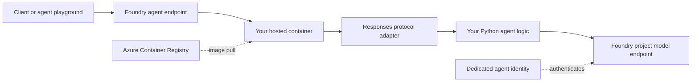

# Microsoft Foundry custom-image hosted agent lab

This repository is a hands-on lab for packaging Python agent code as a custom
Linux container image and deploying that image as a Microsoft Foundry hosted
agent.

The lab deliberately uses the low-level Responses protocol adapter so the
boundary between your code, your image, and the hosted-agent platform is easy
to see.

## What you will learn

By completing the lab, you will be able to explain and demonstrate:

1. Why a hosted agent is the right deployment model when you own the runtime
   and container image.
2. The hosted-agent container contract: Linux `amd64`, port `8088`, a declared
   protocol, and a platform health endpoint.
3. How the container uses its dedicated Microsoft Entra agent identity through
   `DefaultAzureCredential`.
4. How `azd` builds a Dockerfile, pushes the image to Azure Container Registry
   (ACR), creates an agent version, and routes traffic to it.
5. How the workflow changes when a customer supplies a prebuilt image in an
   existing ACR.

## Architecture



Foundry manages the public endpoint, scaling, session lifecycle, and agent
identity. Your image owns the protocol adapter, dependencies, and agent logic.
See the [hosted-agent deployment contract][deploy-docs].

## Repository map

| Path | Purpose |
| --- | --- |
| `azure.yaml` | Declares the Foundry project, model, custom-image agent, protocol, and resources. |
| `src/agent/main.py` | Implements the Responses protocol and calls the Foundry model endpoint. |
| `src/agent/Dockerfile` | Builds the Linux `amd64` image that Foundry runs. |
| `scripts/check-prerequisites.ps1` | Checks the local toolchain without changing it. |
| `scripts/test-image.ps1` | Builds the image and invokes it locally in deterministic echo mode. |
| `docs/customer-walkthrough.md` | A discovery and demonstration guide for a customer call. |

## Lab 0: Check the toolchain

Run:

```powershell
.\scripts\check-prerequisites.ps1
```

The current hosted-agent authoring flow requires:

- Python 3.13 or later.
- Azure Developer CLI (`azd`) 1.27.1 or later.
- The `microsoft.foundry` extension bundle.
- Docker when using container deployment mode.
- Azure CLI for ACR operations and local Azure authentication.

If the check reports an outdated `azd`, upgrade it before installing or
upgrading the Foundry extensions:

```powershell
winget upgrade Microsoft.Azd
azd ext install microsoft.foundry
azd ext upgrade microsoft.foundry
```

Authenticate after the tools are ready:

```powershell
az login
azd auth login
```

## Lab 1: Read the image contract

Open these files together:

1. `src/agent/Dockerfile`
2. `src/agent/main.py`
3. `azure.yaml`

Trace the following contract:

- The image is built for `linux/amd64`.
- The server listens on port `8088`.
- `azure-ai-agentserver-responses` exposes `/responses` and `/readiness`.
- `azure.yaml` declares Responses protocol version `2.0.0`.
- Foundry injects `FOUNDRY_PROJECT_ENDPOINT`.
- The manifest supplies the model deployment name.
- `DefaultAzureCredential` uses your developer identity locally and the
  dedicated agent identity after deployment.

Do not put secrets in the Dockerfile, image, or `azure.yaml`. Assign the agent
identity RBAC access to any external Azure resources it must call.

## Lab 2: Build and invoke the custom image locally

Run the automated smoke test:

```powershell
.\scripts\test-image.ps1
```

The script:

1. Builds `src/agent/Dockerfile` for `linux/amd64`.
   On managed devices, it passes the configured credential-free pip index URL
   as a build argument so the build can use the approved package proxy.
2. Starts the image with `LOCAL_ECHO_MODE=true`.
3. Waits for `/readiness`.
4. Sends a nonstreaming request to `/responses`.
5. Confirms the Responses protocol returns the expected echo.
6. Stops only the container it created.

Echo mode proves that the image and protocol contract work without putting
Azure credentials in the container. The deployed agent never enables echo mode.

## Lab 3: Provision and deploy

The checked-in `azure.yaml` provisions a learning environment with a Foundry
project, a `gpt-5.4-mini` deployment, and the hosted agent. Confirm that the
model and quota are available in your selected region before provisioning.

Create an `azd` environment and deploy:

```powershell
azd env new hosted-agent-lab
azd up
```

`azd up` provisions the declared resources, builds the Docker image, pushes it
to ACR, creates a hosted-agent version, and configures the agent endpoint.

Inspect and invoke the result:

```powershell
azd ai agent show --output table
azd ai agent invoke "Explain what parts of this request are handled by my container."
azd ai agent monitor --follow
```

Every subsequent `azd deploy` creates a new agent version while preserving the
older versions.

### Use an existing Foundry project

If you do not want this lab to provision a project, replace the `ai-project`
service in `azure.yaml` with the existing project endpoint and remove the model
deployment block:

```yaml
services:
  ai-project:
    host: azure.ai.project
    endpoint: https://<account>.services.ai.azure.com/api/projects/<project>
```

Also set `FOUNDRY_MODEL_NAME` under the agent's `env` map to the deployment name
that already exists in that project. You need the **Foundry Project Manager**
role at project scope to deploy a hosted agent.

## Lab 4: Deploy a customer-supplied prebuilt image

The default lab lets `azd` build the checked-in Dockerfile. A centrally managed
customer image uses a different path:

1. Build, scan, sign, and push the image through the customer's pipeline.
2. Pin the image by digest when possible.
3. Add the image reference to the agent service in `azure.yaml`:

   ```yaml
   image: myregistry.azurecr.io/agents/custom-image-agent@sha256:<digest>
   ```

4. Select the prebuilt image in the interactive deployment prompt. For
   unattended deployment, set:

   ```powershell
   azd env set AZD_AGENT_SKIP_ACR true
   ```

5. Deploy:

   ```powershell
   azd deploy
   ```

For a private or centrally managed ACR, the developer needs the appropriate
push or ACR Tasks role for the chosen build path. The hosted agent's identity
always needs image pull access; `azd deploy` normally grants it. Review the
[private ACR deployment guidance][acr-docs] before a customer deployment.

## Lab 5: Explain the identity flow

No API key is baked into this image.

Locally, `DefaultAzureCredential` can use your Azure CLI sign-in. In Foundry,
the platform creates a dedicated Entra service principal for the agent version,
injects the project endpoint, and grants the default access needed for project
model inference and session storage. Grant additional roles explicitly when
the agent must access resources outside those defaults.

## Troubleshooting

| Symptom | Likely cause | Next command |
| --- | --- | --- |
| Prerequisite check rejects `azd` | The core CLI is older than the extension contract. | `winget upgrade Microsoft.Azd` |
| `azd ai agent` is unavailable | Foundry extensions are missing or incompatible. | `azd ext install microsoft.foundry` |
| Docker image runs but model calls fail locally | The container has no developer credential. | Use `azd ai agent run`, or use echo mode only for image validation. |
| Docker build cannot download Python packages | The network requires an approved pip proxy. | Pass `-PipIndexUrl https://proxy.example/pypi/simple` to `test-image.ps1`. |
| Deployment fails with authorization errors | Missing Foundry or ACR role. | `azd ai agent doctor` |
| Image is rejected | It is not a Linux `amd64` image. | `docker build --platform linux/amd64 ...` |
| Agent remains in provisioning | Image pull, startup, or readiness failed. | `azd ai agent show` and `azd ai agent monitor --follow` |
| ACR returns 403 | Build-path role is missing. | Review the role table in the [ACR guide][acr-docs]. |

## Cleanup

If this environment created a disposable project and resource group:

```powershell
azd down
```

If you connected the lab to an existing project, `azd down` does not remove
that project. Delete unused hosted-agent versions and images separately.

## Official references

- [Deploy a hosted agent][deploy-docs]
- [Deploy your own code as a hosted agent][own-code-docs]
- [`azure.yaml` reference][yaml-docs]
- [Deploy from a private or existing ACR][acr-docs]
- [Python Responses protocol package][responses-docs]

[deploy-docs]: https://learn.microsoft.com/azure/foundry/agents/how-to/deploy-hosted-agent
[own-code-docs]: https://learn.microsoft.com/azure/foundry/agents/quickstarts/quickstart-deploy-own-code
[yaml-docs]: https://learn.microsoft.com/azure/foundry/agents/concepts/azure-yaml-reference
[acr-docs]: https://learn.microsoft.com/azure/foundry/agents/how-to/deploy-hosted-agent-private-azure-container-registry
[responses-docs]: https://learn.microsoft.com/python/api/overview/azure/ai-agentserver-responses-readme
