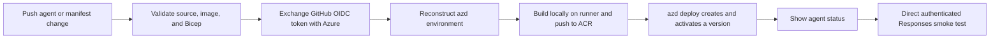

# GitHub Actions deployment for the root hosted agent

This guide deploys the root `custom-image-hosted-agent-lab` with GitHub Actions, Azure workload identity federation (OIDC), and `azd`. It is a **release workflow for an already configured environment**: it validates the source image and Bicep, rebuilds and pushes the image to ACR, deploys a hosted-agent version, shows its status, and invokes the active Responses endpoint directly.

It does not put a client secret in GitHub. The workflow exchanges a short-lived GitHub OIDC token through `azure/login` and gives its Azure identity only the scoped permissions needed for the selected build and release path.

## Release flow



The root workflow is deliberately scoped to `azure.yaml`, `src/agent/**`, and itself. Documentation and Bicep changes do not silently release the production-like agent. Release jobs share a concurrency group and do not cancel an in-progress deployment.

## Prerequisites and boundaries

Before configuring the workflow, confirm all of the following:

1. A Foundry project, model deployment, ACR connection, and quota are healthy.
2. The root agent builds and passes its local Responses test.
3. A GitHub administrator can set repository variables and inspect the repository's OIDC subject configuration.
4. An Azure administrator can create a user-assigned managed identity and role assignments at the Foundry project and ACR scopes.
5. The workflow uses an existing `azd` environment name reserved for CI; it never calls `azd provision` during a release.

The automatic root flow is a lab/demo release: `azd deploy` can create and activate a version in one operation, then the workflow tests the active endpoint. It is **not** candidate-before-activation promotion. For a production gate, build and push a digest-pinned candidate, create and test that candidate through the Foundry SDK or REST API, require a protected GitHub Environment approval, and explicitly activate the approved version. See [Module 6: lifecycle]({{ '/course/modules/06-lifecycle/' | relative_url }}) and the [REST deployment lesson]({{ '/course/modules/11-rest-api/' | relative_url }}).

## Safe identity bootstrap

### New environment: provision the checked-in stack once

For a new lab environment, the checked-in Bicep can create its optional GitHub Actions identity alongside the new Foundry stack:

```powershell
azd env new <new-environment-name>
azd env set AZURE_LOCATION <azure-region>
azd env set ENABLE_GITHUB_ACTIONS_IDENTITY true
azd provision --no-prompt
```

Before provisioning a fork or a different repository, inspect and replace the federated credential subject in the checked-in identity module. It is intentionally repository-bound and must match the current repository's OIDC subject; never copy another repository's numeric owner or repository IDs.

### Existing environment: do not run full-stack provisioning

Do **not** enable the identity and run the root `azd provision` against an existing environment just because the intent is to add CI identity. A real `az deployment sub what-if` can show `Modify` operations for the Foundry account/project/model, ACR, connections, and Application Insights. Full-stack provisioning is not a harmless or universally idempotent identity bootstrap.

Use one of these approaches instead:

1. Extract or maintain an identity-only Bicep module containing only the user-assigned identity, its federated credential, and scoped role assignments.
2. Use the narrow Azure CLI bootstrap below.

For either approach, run an Azure Resource Manager what-if against the exact deployment scope and parameters first, review every `Modify`, `Create`, and `Delete`, and proceed only when the plan is identity-only. Microsoft documents what-if behavior and its limits in [Preview Azure deployment changes by using what-if](https://learn.microsoft.com/azure/azure-resource-manager/templates/deploy-what-if).

### Identity-only Azure CLI bootstrap

Replace every angle-bracket placeholder. This example intentionally contains no tenant, subscription, client, project, registry, or repository identifiers.

```powershell
$resourceGroup = "<resource-group>"
$identityName = "<github-actions-identity-name>"
$projectResourceId = "<foundry-project-resource-id>"
$registryResourceId = "<acr-resource-id>"
$oidcSubject = "<subject-inspected-for-this-repository>"
$acrDataPlaneRole = "<AcrPush-or-Container-Registry-Repository-Writer>"

az identity create --resource-group $resourceGroup --name $identityName

$identity = az identity show --resource-group $resourceGroup --name $identityName | ConvertFrom-Json

az identity federated-credential create `
  --resource-group $resourceGroup `
  --identity-name $identityName `
  --name "github-release" `
  --issuer "https://token.actions.githubusercontent.com" `
  --subject $oidcSubject `
  --audiences "api://AzureADTokenExchange"

az role assignment create `
  --assignee-object-id $identity.principalId `
  --assignee-principal-type ServicePrincipal `
  --role "Foundry Project Manager" `
  --scope $projectResourceId

az role assignment create `
  --assignee-object-id $identity.principalId `
  --assignee-principal-type ServicePrincipal `
  --role $acrDataPlaneRole `
  --scope $registryResourceId

$identity.clientId
```

Record only the final client ID as the `AZURE_CLIENT_ID` repository variable. Obtain the tenant and subscription identifiers from the intended Azure context; none are secrets, but they should not be committed to source files.

### Configure the OIDC subject deliberately

GitHub's current immutable-subject behavior can include owner and repository IDs. The exact `sub` is a repository setting, so inspect it rather than copying a literal subject from this lab:

```powershell
gh api repos/<owner>/<repository>/actions/oidc/customization/sub
```

Use the returned `sub_claim_prefix` as the source of truth. Append `:ref:refs/heads/<branch>` for a branch workflow or `:environment:<environment>` for an environment workflow. The optional checked-in Bicep identity reads the exact value from `GITHUB_ACTIONS_FEDERATED_SUBJECT`, so set it before provisioning:

```powershell
azd env set GITHUB_ACTIONS_FEDERATED_SUBJECT '<sub_claim_prefix>:ref:refs/heads/<branch>'
```

Use the [GitHub OIDC reference](https://docs.github.com/actions/reference/security/oidc) to interpret the returned claim customization and configure the Azure federated credential for that exact subject. The traditional branch-scoped form is `repo:<owner>/<repository>:ref:refs/heads/<branch>`; immutable subject configurations can include immutable IDs as well.

If the job does not declare a GitHub Environment, use a branch subject and trust only the release branch. If the job declares `environment: <name>`, GitHub uses an environment subject rather than the branch form. Protect that Environment with required reviewers and deployment branch/tag rules before making it a trust boundary. The [GitHub OIDC guidance for Azure](https://docs.github.com/actions/how-tos/secure-your-work/security-harden-deployments/oidc-in-azure) explains the claim and environment implications.

> **Rename or transfer checkpoint:** A repository rename or transfer can change the emitted subject prefix even when immutable owner and repository IDs are included. Before the next deployment, re-run the GitHub OIDC customization query, update `GITHUB_ACTIONS_FEDERATED_SUBJECT` and the Azure federated credential when they differ, then prove the change with a manual workflow dispatch.

### Choose the ACR data-plane role

The required ACR role depends on the build path and the registry's role-assignment permissions mode:

| Build path or registry mode | Identity role | Why |
| --- | --- | --- |
| This lab's local Docker build and data-plane push to an ACR using `LegacyRegistryPermissions` | `AcrPush` | It permits the runner to push image content. |
| ACR using RBAC + ABAC Repository Permissions | `Container Registry Repository Writer` | It grants repository data-plane write access; scope it to the intended repository when policy requires. |
| ACR Tasks management | `Tasks Contributor` | It manages ACR tasks and is insufficient for a local Docker data-plane push. |

Use the registry's Properties blade or Azure CLI to identify its role-assignment permissions mode before assigning roles. The [ACR roles directory](https://learn.microsoft.com/azure/container-registry/container-registry-rbac-built-in-roles-directory-reference) distinguishes registry control-plane and image data-plane permissions.

The Foundry project identity still needs the pull permission required by its ACR project connection. That runtime/pull identity is different from the GitHub deployment identity and should not receive the deployment identity's broad lifecycle permissions.

## Required GitHub Actions variables

Create these **repository variables** (not secrets) under **Settings > Secrets and variables > Actions**. Do not write their values to workflow files or commit them. The workflow requires every variable before it asks Azure to authenticate.

| Variable | Value |
| --- | --- |
| `AZURE_CLIENT_ID` | Client ID of the user-assigned deployment identity. |
| `AZURE_TENANT_ID` | Tenant ID containing that identity. |
| `AZURE_SUBSCRIPTION_ID` | Subscription containing the target resources. |
| `AZURE_LOCATION` | Existing environment location. |
| `AZURE_RESOURCE_GROUP` | Resource group containing the target Foundry project and ACR. |
| `AZURE_CONTAINER_REGISTRY_ENDPOINT` | ACR login server, such as `<registry>.azurecr.io`. |
| `AZURE_CONTAINER_REGISTRY_RESOURCE_ID` | Full resource ID of that ACR. |
| `FOUNDRY_PROJECT_ENDPOINT` | Foundry project endpoint. |
| `AZURE_AI_PROJECT_ID` | Full Foundry project resource ID. |
| `FOUNDRY_MODEL_DEPLOYMENT_NAME` | Existing model deployment name. |
| `AZD_ENV_NAME` | Stable, CI-reserved `azd` environment name. |

These are identifiers, not credentials. Do not create an `AZURE_CLIENT_SECRET`: the workflow has `id-token: write` and uses Azure Login OIDC instead.

## Copyable representative workflow

This representative workflow mirrors the root release design. Adapt the agent name, release branch, OIDC subject, and repository variables to the target repository before use.

```yaml
name: Deploy hosted agent

on:
  push:
    branches: [main]
    paths:
      - azure.yaml
      - src/agent/**
      - .github/workflows/deploy-hosted-agent.yml
  workflow_dispatch:

permissions:
  contents: read
  id-token: write

concurrency:
  group: hosted-agent-release
  cancel-in-progress: false

env:
  AGENT_NAME: custom-image-hosted-agent-lab
  AGENT_SMOKE_PROMPT: "Reply with a concise confirmation that the Responses protocol is available."

jobs:
  deploy-and-smoke-test:
    runs-on: ubuntu-latest
    steps:
      - uses: actions/checkout@v4

      - uses: Azure/setup-azd@v2

      - name: Install required azd extensions
        shell: bash
        run: |
          set -euo pipefail
          azd ext install microsoft.foundry
          azd ext install azure.ai.agents
          azd ext install azure.ai.projects
          azd ai agent --help >/dev/null

      - name: Validate inputs
        shell: bash
        run: |
          set -euo pipefail
          python -m unittest discover -s tests -v
          python -m compileall -q src tests
          az bicep build --file infra/main.bicep --stdout >/dev/null
          pwsh -File ./scripts/test-image.ps1 -ImageName "$AGENT_NAME:ci" -ProjectPath ./src/agent -Port 18088

      - name: Validate required repository variables
        shell: bash
        env:
          AZURE_CLIENT_ID: ${{ vars.AZURE_CLIENT_ID }}
          AZURE_TENANT_ID: ${{ vars.AZURE_TENANT_ID }}
          AZURE_SUBSCRIPTION_ID: ${{ vars.AZURE_SUBSCRIPTION_ID }}
          AZURE_LOCATION: ${{ vars.AZURE_LOCATION }}
          AZURE_RESOURCE_GROUP: ${{ vars.AZURE_RESOURCE_GROUP }}
          AZURE_CONTAINER_REGISTRY_ENDPOINT: ${{ vars.AZURE_CONTAINER_REGISTRY_ENDPOINT }}
          AZURE_CONTAINER_REGISTRY_RESOURCE_ID: ${{ vars.AZURE_CONTAINER_REGISTRY_RESOURCE_ID }}
          FOUNDRY_PROJECT_ENDPOINT: ${{ vars.FOUNDRY_PROJECT_ENDPOINT }}
          AZURE_AI_PROJECT_ID: ${{ vars.AZURE_AI_PROJECT_ID }}
          FOUNDRY_MODEL_DEPLOYMENT_NAME: ${{ vars.FOUNDRY_MODEL_DEPLOYMENT_NAME }}
          AZD_ENV_NAME: ${{ vars.AZD_ENV_NAME }}
        run: |
          set -euo pipefail
          required=(
            AZURE_CLIENT_ID AZURE_TENANT_ID AZURE_SUBSCRIPTION_ID AZURE_LOCATION
            AZURE_RESOURCE_GROUP AZURE_CONTAINER_REGISTRY_ENDPOINT
            AZURE_CONTAINER_REGISTRY_RESOURCE_ID FOUNDRY_PROJECT_ENDPOINT
            AZURE_AI_PROJECT_ID FOUNDRY_MODEL_DEPLOYMENT_NAME AZD_ENV_NAME
          )
          missing=()
          for name in "${required[@]}"; do
            [[ -n "${!name:-}" ]] || missing+=("$name")
          done
          if ((${#missing[@]})); then
            printf '::error::Missing required GitHub Actions variables: %s\n' "$(IFS=', '; echo "${missing[*]}")"
            exit 1
          fi

      - name: Sign in to Azure with OIDC
        uses: azure/login@v2
        with:
          client-id: ${{ vars.AZURE_CLIENT_ID }}
          tenant-id: ${{ vars.AZURE_TENANT_ID }}
          subscription-id: ${{ vars.AZURE_SUBSCRIPTION_ID }}

      - name: Configure azd for Azure CLI authentication
        shell: bash
        run: |
          set -euo pipefail
          azd config set auth.useAzCliAuth true
          azd config set defaults.subscription "${{ vars.AZURE_SUBSCRIPTION_ID }}"

      - name: Reconstruct the azd environment
        shell: bash
        run: |
          set -euo pipefail
          azd env select "${{ vars.AZD_ENV_NAME }}" || azd env new "${{ vars.AZD_ENV_NAME }}" --no-prompt
          azd env set AZURE_SUBSCRIPTION_ID "${{ vars.AZURE_SUBSCRIPTION_ID }}"
          azd env set AZURE_TENANT_ID "${{ vars.AZURE_TENANT_ID }}"
          azd env set AZURE_LOCATION "${{ vars.AZURE_LOCATION }}"
          azd env set AZURE_RESOURCE_GROUP "${{ vars.AZURE_RESOURCE_GROUP }}"
          azd env set AZURE_CONTAINER_REGISTRY_ENDPOINT "${{ vars.AZURE_CONTAINER_REGISTRY_ENDPOINT }}"
          azd env set AZURE_CONTAINER_REGISTRY_RESOURCE_ID "${{ vars.AZURE_CONTAINER_REGISTRY_RESOURCE_ID }}"
          azd env set FOUNDRY_PROJECT_ENDPOINT "${{ vars.FOUNDRY_PROJECT_ENDPOINT }}"
          azd env set AZURE_AI_PROJECT_ID "${{ vars.AZURE_AI_PROJECT_ID }}"
          azd env set AZURE_AI_FOUNDRY_PROJECT_ID "${{ vars.AZURE_AI_PROJECT_ID }}"
          azd env set MICROSOFT_FOUNDRY_MODEL_DEPLOYMENT_NAME "${{ vars.FOUNDRY_MODEL_DEPLOYMENT_NAME }}"

      - name: Deploy and show the agent
        shell: bash
        run: |
          set -euo pipefail
          azd deploy --no-prompt
          azd ai agent show --no-prompt --output table

      - name: Smoke test the active Responses endpoint
        shell: bash
        env:
          FOUNDRY_PROJECT_ENDPOINT: ${{ vars.FOUNDRY_PROJECT_ENDPOINT }}
        run: |
          set -euo pipefail
          request_file="$(mktemp)"
          response_file="$(mktemp)"
          trap 'rm -f "$request_file" "$response_file"' EXIT

          access_token="$(az account get-access-token --resource https://ai.azure.com --query accessToken --output tsv)"
          [[ -n "$access_token" ]] || { echo "::error::Azure CLI returned no Azure AI token."; exit 1; }

          jq --null-input --arg input "$AGENT_SMOKE_PROMPT" '{input: $input, store: true}' >"$request_file"
          agent_endpoint="${FOUNDRY_PROJECT_ENDPOINT%/}/agents/${AGENT_NAME}/endpoint/protocols/openai/responses?api-version=v1"

          if ! http_status="$(curl --silent --show-error --output "$response_file" --write-out '%{http_code}' --request POST "$agent_endpoint" --header "Authorization: Bearer $access_token" --header 'Content-Type: application/json' --data-binary "@$request_file")"; then
            echo "::error::The Responses request could not reach the agent endpoint."
            [[ -s "$response_file" ]] && cat "$response_file"
            exit 1
          fi

          if [[ ! "$http_status" =~ ^2 ]]; then
            echo "::error::The Responses request returned HTTP $http_status."
            cat "$response_file"
            exit 1
          fi

          if ! jq -e '
            .status == "completed" and
            any(.output[]?; .type == "message" and .role == "assistant" and any(.content[]?; .type == "output_text" and (.text | type == "string") and (.text | length > 0)))
          ' "$response_file" >/dev/null; then
            echo "::error::The Responses request was not completed with assistant output."
            cat "$response_file"
            exit 1
          fi

          jq -r '.output[]? | select(.type == "message" and .role == "assistant") | .content[]? | select(.type == "output_text") | .text' "$response_file"
```

The endpoint smoke test intentionally does not use `azd ai agent invoke`. A client-side wrapper failure can make the workflow red even when the deployed endpoint is healthy. The direct request preserves the HTTP status and response body for diagnostics without printing the bearer token.

## First run and evidence

1. Add the variables, validate the federated credential subject, and trigger `workflow_dispatch`.
2. Resolve any preflight error before re-running; an OIDC failure usually means a missing variable or a subject/audience mismatch.
3. Confirm that `azd deploy` completes and `azd ai agent show` reports the expected version state.
4. Treat the direct Responses HTTP status, response body, and completed assistant output as release evidence.

For this lab, the public [successful run](https://github.com/ericchansen/foundry-hosted-agents/actions/runs/31810388427) on merge commit `fd815705` passed validation, OIDC, ACR push, `azd deploy`, agent status, and the direct Responses smoke test. It created Version 2 active and returned `Confirmed: the Responses protocol is available.` The published lab image digest was `sha256:2057b5aeaaf82cfbc1f5a5c3b784a60b5554ce6779ac6090cb82009d6b3b6046`.

## Rollback and production promotion

For the automatic lab flow, inspect the prior known-good version and explicitly reactivate it according to the supported Foundry lifecycle interface. Do not rebuild an old tag to roll back: use the recorded version and immutable image digest as the rollback evidence.

For production, separate creation from activation:

1. Build, scan, sign, and push a digest-pinned candidate image.
2. Create and poll the candidate version with the Foundry SDK or REST API.
3. Invoke the candidate endpoint and collect smoke, telemetry, and policy evidence.
4. Require a protected GitHub Environment approval for the promotion job.
5. Explicitly activate the approved candidate and retain the prior active version for rollback.

## Troubleshooting

| Symptom | Likely cause | Evidence and smallest correction |
| --- | --- | --- |
| `azure/login` cannot authenticate | Required variable is empty, or issuer/audience/subject does not match the federated credential. | Check the variable preflight, inspect the repository OIDC subject configuration, and match the Azure credential exactly. |
| `azd` cannot choose a registry | ACR endpoint or resource ID was not reconstructed in the CI `azd` environment. | Verify both ACR variables and `azd env get-values`; do not replace them with a registry name alone. |
| Local Docker push returns 401/403 | The deployment identity lacks the registry data-plane push role. | For this lab's `LegacyRegistryPermissions` path, assign `AcrPush`; for ABAC mode, use `Container Registry Repository Writer`. Do not use `Tasks Contributor` as a substitute. |
| `azd ai agent invoke` fails after deployment | The CLI wrapper failed independently of the endpoint. | Use the direct authenticated Responses request and its HTTP/body diagnostics before treating deployment as failed. |
| Responses request is not 2xx | Wrong endpoint, token audience, agent name, or an active-version/runtime failure. | Preserve the status and body, then inspect `azd ai agent show`, monitor telemetry, and compare the endpoint and agent name. |
| Full-stack what-if lists changes to existing services | A broad `azd provision` would mutate existing infrastructure. | Stop and use an extracted identity-only template or the narrow CLI bootstrap after reviewing an identity-only what-if. |

For the broader diagnostic ladder, use the [troubleshooting playbook]({{ '/troubleshooting-playbook/' | relative_url }}).

## Official references

- [Set up CI/CD for a hosted agent](https://learn.microsoft.com/azure/foundry/agents/quickstarts/set-up-cicd-hosted-agent)
- [Deploy a hosted agent](https://learn.microsoft.com/azure/foundry/agents/how-to/deploy-hosted-agent)
- [GitHub OIDC reference](https://docs.github.com/actions/reference/security/oidc)
- [Configure OIDC in Azure](https://docs.github.com/actions/how-tos/secure-your-work/security-harden-deployments/oidc-in-azure)
- [Authenticate GitHub Actions to Azure with OIDC](https://learn.microsoft.com/azure/developer/github/connect-from-azure-openid-connect)
- [Azure Container Registry roles directory](https://learn.microsoft.com/azure/container-registry/container-registry-rbac-built-in-roles-directory-reference)
- [Preview Azure deployment changes with what-if](https://learn.microsoft.com/azure/azure-resource-manager/templates/deploy-what-if)
