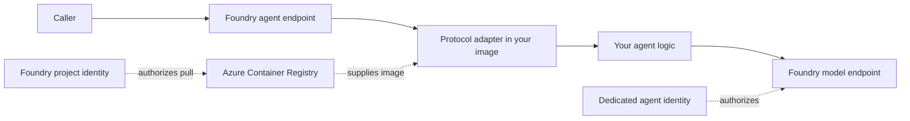

# Hosted-agent mental model

## The shortest useful definition

A Microsoft Foundry hosted agent is **your container** running behind a
**Foundry-managed agent endpoint** with a **dedicated Entra identity** and a
declared **agent protocol**.

## Four boundaries

### 1. Platform boundary

Foundry owns the public endpoint, agent version lifecycle, routing, platform
session context, scaling, and the dedicated agent identity.

### 2. Image boundary

You own the operating system base, Python packages, protocol library, startup
command, application code, writable paths, and any native dependencies.

### 3. Protocol boundary

The protocol is the contract between the Foundry gateway and your container.
This course starts with Responses protocol version `2.0.0`, which exposes
`/responses`. The protocol library also exposes `/readiness`.

### 4. Identity boundary

Locally, `DefaultAzureCredential` normally resolves a developer credential. In
the hosted runtime, it resolves the dedicated agent identity. Access to the
project model and session storage is part of the default hosted-agent path.
External resources require explicit role assignments or project connections.

Image retrieval uses a separate identity path. The ACR project connection uses
the Foundry project managed identity, which needs pull access to the registry.
The dedicated agent identity is created with the agent deployment and is the
identity used by code running inside the container.

## Deployment interfaces and artifacts

Choose an interface to create and operate the agent version, then choose the
artifact that Foundry runs. These are independent decisions.

| Interface | Best use |
| --- | --- |
| Azure Developer CLI (`azd`) | Guided provisioning and deployment with automated packaging and RBAC setup |
| Python SDK | Python automation or applications that own the release workflow |
| REST API | Language-agnostic tools and existing delivery systems |

| Artifact path | Artifact supplied to Foundry | Best use |
| --- | --- | --- |
| Source deployment | Python or .NET source archive | Fast inner loop without owning the image |
| Container build | Dockerfile and source | You own runtime dependencies and want `azd` to build |
| Prebuilt image | ACR image tag or digest | A separate pipeline owns build, scan, signing, and release |

This course covers all three interfaces, plus each of these artifact paths.

## Request path

1. A caller invokes the Foundry agent endpoint.
2. Foundry selects an active agent version.
3. The gateway forwards the protocol request to the container.
4. The protocol adapter creates request context and calls your handler.
5. Your handler invokes the model or tools using the agent identity.
6. The adapter emits a protocol-compliant response.
7. Foundry returns it to the caller and emits platform telemetry.

## A useful troubleshooting rule

Always move outward from the smallest boundary:

1. Does the code start?
2. Does the container start?
3. Is `/readiness` healthy?
4. Does the declared protocol respond?
5. Can the container acquire an identity token?
6. Can that identity reach the dependency?
7. Did Foundry create and route the expected agent version?
