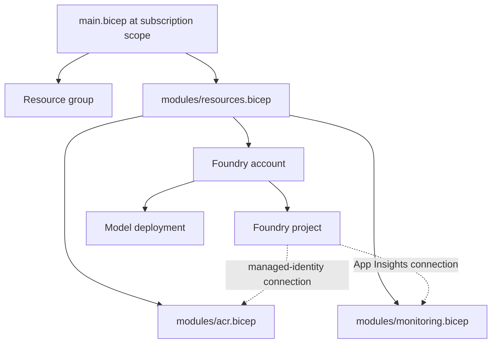

# Durable Azure infrastructure

This folder contains the Azure Resource Manager graph for the long-lived course
environment. It is intentionally explicit so Module 4 can deploy and inspect
the same resources that `azd provision` operates in Module 5.

## Ownership boundary

| Owner | Resources and lifecycle |
| --- | --- |
| Bicep | Resource group, Foundry account and project, model deployment, ACR, Log Analytics, Application Insights, project connections, and stable role assignments |
| Foundry `azd` extensions | Image build and push, dedicated agent identity, hosted-agent endpoint, version creation, protocol endpoints, and version activation |

Hosted-agent versions are release artifacts, so they do not belong in this
stable infrastructure graph.

## Module graph

`accounts/projects/connections@2025-04-01-preview` is deliberate. The current
Foundry templates use that API for Container Registry connections because the
newer resource API does not currently resolve this connection category
reliably.

## Identity matrix

| Principal | Role and scope | Why |
| --- | --- | --- |
| Developer or CI principal | Foundry Project Manager on the project | Deploy and operate hosted agents |
| Developer or CI principal | Container Registry Tasks Contributor on ACR | Build and push container images |
| Foundry project managed identity | AcrPull on ACR | Supply images to the hosted-agent platform |
| Foundry project managed identity | Log Analytics Reader on Application Insights | Read traces for evaluation |
| Dedicated agent identity | Created during `azd deploy`, not in Bicep | Authenticate runtime code to models and dependencies |

Creating these role assignments requires a principal with role-assignment
permissions, such as Owner or Role Based Access Control Administrator.

## Important outputs

The top-level template exposes the project ID and endpoint, OpenAI endpoint,
registry endpoint and connection, and Application Insights connection. `azd`
persists top-level outputs into its selected environment so the Foundry
extensions can deploy the agent without rediscovering the resource graph.

## Cost-bearing resources

The model deployment consumes quota and may incur inference cost. ACR Premium,
Log Analytics, Application Insights, and hosted-agent runtime usage can also
incur cost. The environment is long-lived by design; use `azd down` only when
you deliberately want to remove it.

## References

- [Foundry account and project Bicep resources](https://learn.microsoft.com/azure/templates/microsoft.cognitiveservices/accounts/projects)
- [Foundry project connection Bicep resource](https://learn.microsoft.com/azure/templates/microsoft.cognitiveservices/accounts/projects/connections)
- [Deploy a hosted agent](https://learn.microsoft.com/azure/foundry/agents/how-to/deploy-hosted-agent)
- [Deploy from a private or existing ACR](https://learn.microsoft.com/azure/foundry/agents/how-to/deploy-hosted-agent-private-azure-container-registry)
- [Azure built-in roles](https://learn.microsoft.com/azure/role-based-access-control/built-in-roles)
