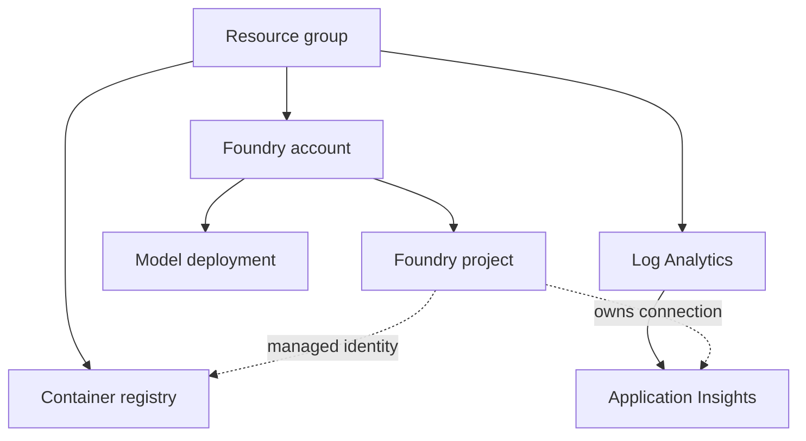

# Module 4: Provision the environment with Bicep

## Objective

Provision and explain the long-lived Azure demo environment without relying on
`azd` to hide the infrastructure graph.

## Diagnose

List the Azure resources you expect before opening `infra/`. For each, state
whether it is control plane, data plane, compute artifact storage, model
capacity, or observability.

## Predict

Open `infra/main.bicep` and follow each module reference. Before reading module
outputs, predict which resource IDs and endpoints the hosted-agent deployment
will need.

## Learn

Build this graph from the Bicep:



Explain why the agent version itself is not created by the infrastructure
deployment.

Classify the role assignments before deploying:

| Principal | Scope | Role | Purpose |
| --- | --- | --- | --- |
| Developer or CI principal | Foundry project | Foundry Project Manager | Deploy and operate the hosted agent |
| Developer or CI principal | ACR | Container Registry Tasks Contributor | Build and push images |
| Foundry project identity | ACR | AcrPull | Let the platform retrieve agent images |
| Foundry project identity | Application Insights | Log Analytics Reader | Query agent traces for evaluation |

The dedicated agent identity is intentionally absent from this graph. It is
created later with the agent deployment and is used by code inside the runtime.

## Perform

Authenticate and choose the subscription deliberately:

```powershell
az login
az account list --output table
az account set --subscription "<subscription-name-or-id>"
$principalId = az ad signed-in-user show --query id --output tsv
```

The deploying principal must be able to create role assignments, such as
**Owner** or **Role Based Access Control Administrator**, because this template
assigns narrowly scoped project, registry, and telemetry roles.

Preview:

```powershell
az deployment sub what-if `
  --location <location> `
  --template-file .\infra\main.bicep `
  --parameters environmentName=<environment-name> `
               location=<location> `
               principalId=$principalId `
               principalType=User
```

Review every create or modify operation before deploying.

Deploy:

```powershell
az deployment sub create `
  --name <environment-name>-foundry `
  --location <location> `
  --template-file .\infra\main.bicep `
  --parameters environmentName=<environment-name> `
               location=<location> `
               principalId=$principalId `
               principalType=User
```

Save the deployment outputs as evidence.

## Inspect

Use Azure Resource Graph or the portal to map each output back to a resource.
Confirm the model deployment and registry exist in the intended region and
resource group.

## Exercise

Run the same deployment again. Predict the change set before running it. A
long-lived demo environment must converge without replacing stable resources.

## Debug

Use a model or region with no quota in a `what-if` discussion. Identify which
failure can be caught before deployment and which requires a deployment
operation.

## Teach back

Explain the resource graph, what incurs cost, and why hosted-agent versions are
deployed after infrastructure.

## Checkpoint

Advance only when:

- The direct Bicep deployment succeeds.
- A second preview is idempotent.
- You can identify every deployment output without the portal.

## Current Microsoft references

- [Foundry account and project Bicep resources](https://learn.microsoft.com/azure/templates/microsoft.cognitiveservices/accounts/projects)
- [Foundry project connection Bicep resource](https://learn.microsoft.com/azure/templates/microsoft.cognitiveservices/accounts/projects/connections)
- [Azure built-in roles](https://learn.microsoft.com/azure/role-based-access-control/built-in-roles)
- [Hosted agent deployment](https://learn.microsoft.com/azure/foundry/agents/how-to/deploy-hosted-agent)
